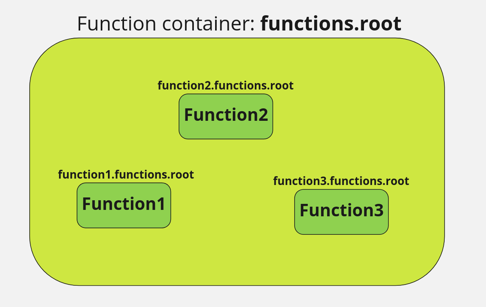
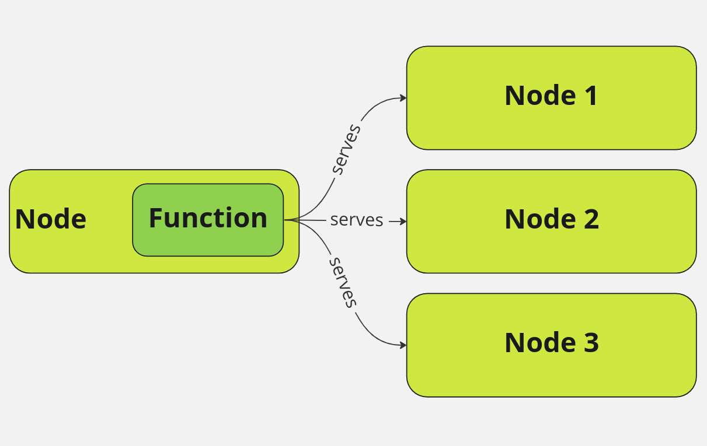
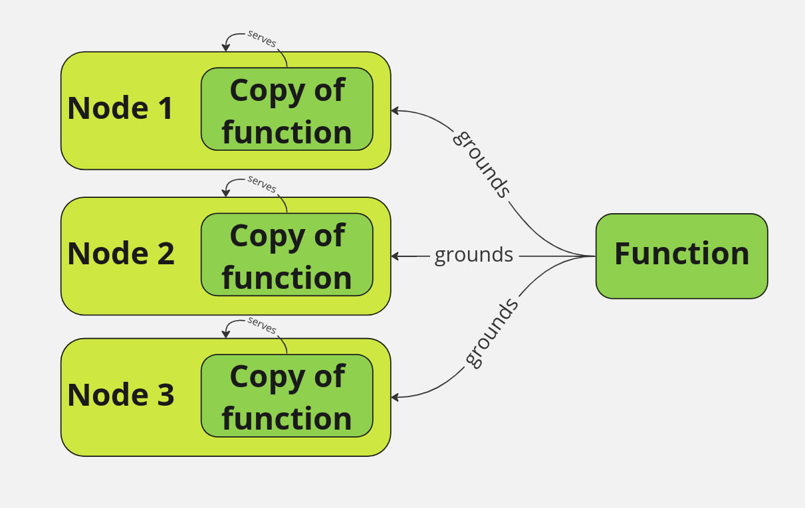

# Proxy

## Info

Proxy listen on URL: `http://${address}/proxy`

Flink's `module.yaml` example:

```yaml
kind: io.statefun.endpoints.v2/http
spec:
  functions: proxy/*
  urlPathTemplate: http://${address}/proxy
  maxNumBatchRequests: 1
  transport:
    type: io.statefun.transports.v1/async
    connect: 5s
    call: 600s
    payload_max_bytes: 52428800

```

## Run

### Environment variables

|Variable|Default|Description|
|:------:|:-----:|:---------:|
|STATEFUN_PROXY_DEBUG|""|Debug log level|

## Functions

Foliage stores stateful functions in a function container:



There are two types of functions: non-grounded and grounded.

### Non-grounded functions



Non-grounded functions exist in a single copy.<br/>
To define a function, set the flag `grounded` to `false` on bootstrap:
<pre>
function := pbtypes.Function{
    FunctionType: &pbtypes.FunctionType{
        Namespace: types.Namespace,
        Type:      types.FunctionType,
    },
    Description: types.Description,
    <b>Grounded:    false</b>,
}
</pre>

Each function must have a link with a route to be available for execution.
Before creating the link, define a route to the external module that contains the function:
<pre>
route := &pbtypes.FunctionRoute{
    Url: "http://<b>hostname</b>:31001/statefun",
}
</pre>

**NOTE:** Optional flags `ExecuteOnCreate` and `ExecuteOnUpdate` are not used for non-grounded functions.

### Grounded



Grounded functions can exist in multiple copies. A copy of the function runs directly on the served node.<br/>

To define a function, set the flag `grounded` to `true` on bootstrap (default):
<pre>
function := pbtypes.Function{
    FunctionType: &pbtypes.FunctionType{
        Namespace: types.Namespace,
        Type:      types.FunctionType,
    },
    Description: types.Description,
    <b>Grounded:    true</b>,
}
</pre>

Each function must have a link with a route to be available for execution.
Before creating the link, define a route to the external module that contains the function:
<pre>
route := &pbtypes.FunctionRoute{
    Url: "http://<b>hostname</b>:31001/statefun",
    ExecuteOnCreate: true,
    ExecuteOnUpdate: true,
}
</pre>

**NOTE:** Optional flags `ExecuteOnCreate` and `ExecuteOnUpdate` can be used for grounded functions to trigger a function on create and/or update action.
